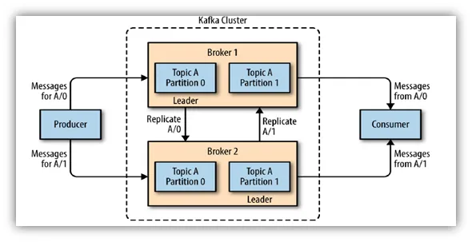

# Kafka

## Architecture



## Deploy locally

### With Zookeeper

Critically, since version 2.8.0, Apache Kafka supports a mode that doesn’t depend on ZooKeeper. Further, as of Confluent Platform 7.5, ZooKeeper is deprecated. This is why we specifically indicate the versions of both the ZooKeeper and Kafka containers as 7.4.4.

To start an Apache Kafka server, we’d first need to start a Zookeeper server.
We can configure this dependency in a docker-compose.yml file, which ensures that the Zookeeper server always starts before the Kafka server and stops after it.
We have a docker-compose.yml file with two services, namely zookeeper and kafka:

```sh
cd setup/zookeeper
docker-compose up
```

### Without Zookeeper

Now Kafka can run without the Zookeeper module where the implementation for the configuration is replaced by Kraft. Here we deploy the Kafka without Zookeeper and add a UI to it as well.

```sh
cd setup/kraft
docker-compose up
```